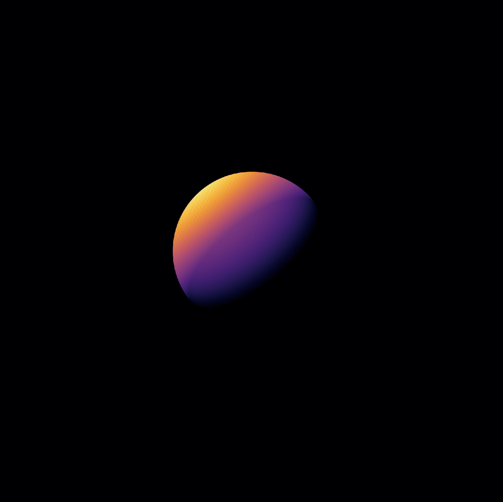

# ray-tracing-sphere
CUDA program to generate an image of a ray-traced sphere

## Run-Time Analysis

| Number of Rays              | CUDA Run Time (s)       | Serial Run Time (s)  | CUDA Time / Serial Time |
| :------------------------ |:-------------:|:-------------:|:-------------|
|10|0.19|0.006|0.03
|100|0.19|0.006|0.03
|1000|0.19|0.007|0.04
|10000|0.19|0.032|0.17
|100000|0.19|0.24|1.26
|1000000|0.21|2.26|10.8
|10000000|0.38|22.7|59.7
|100000000|1.69|223|132
|1000000000|15.2||
|10000000000|21.6||
